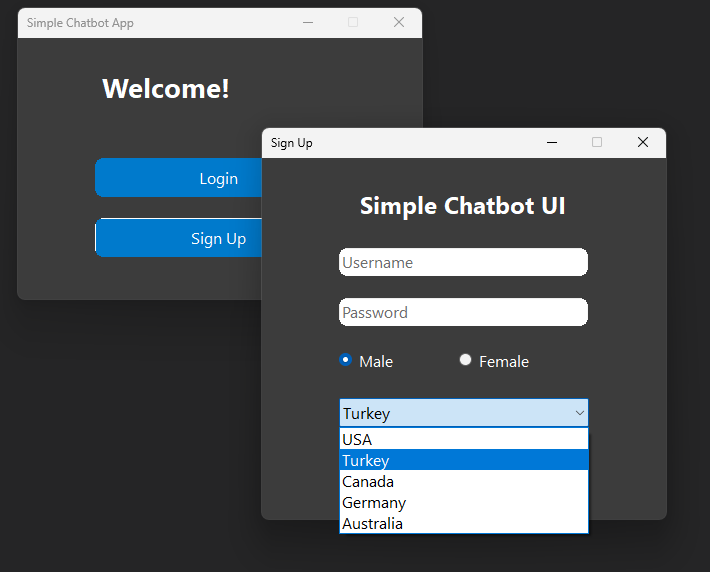
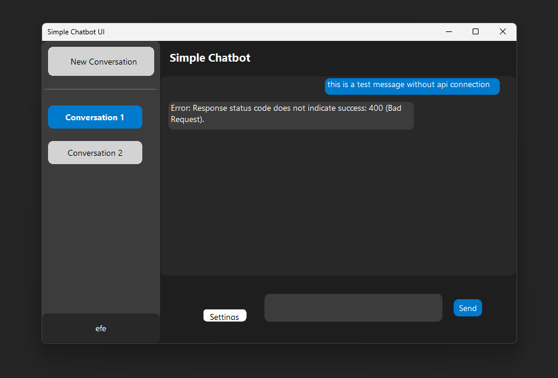
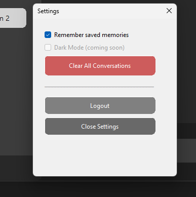

# BasitChatbot

A simple ChatGPT-like chatbot UI built using C# and Windows Forms. Built as a basic school project but a foundation for bigger vision.

## Features
- Login / Signup UI
- First page navigation
- Chat interface design

## Technologies
- C#
- Windows Forms (WinForms)
- .NET

## How to Run
1. Clone the repository.
2. Open `WinFormsApp2.sln` in Visual Studio.
3. Build and run the project.

## Screenshots

Sign Up Page:

Main Page:

Settings Page:

## License

